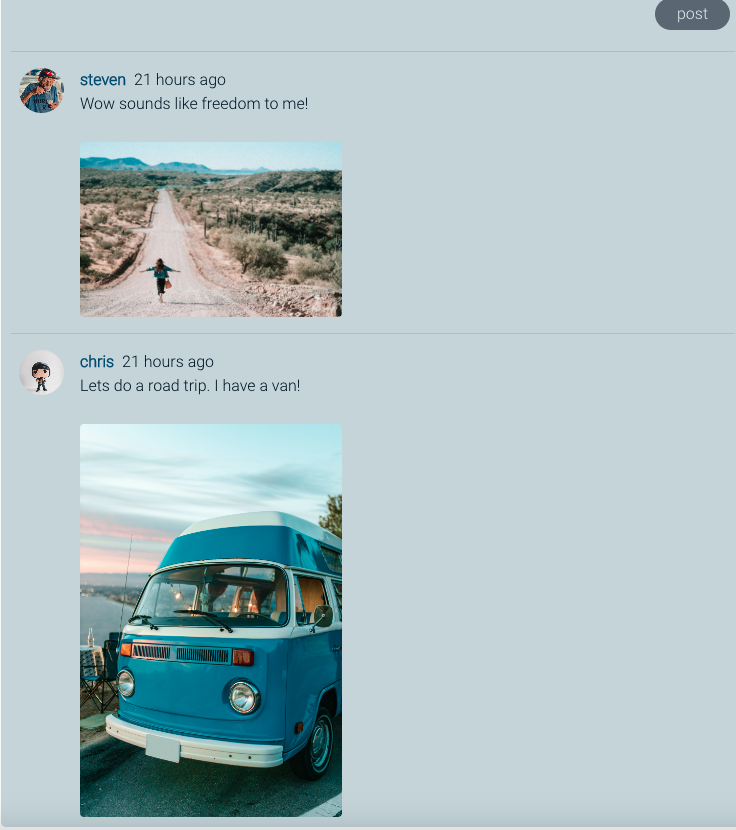

 ADD DEPLOYED FRONT-END ISTE
 ADD DEPLOYED API 
 ADD API REPO
 ADD FRONT-END REPO

 "Capturing the World: Exploring New Places and Moments Through the Lens"
<ul>Structure
<li><a href="#project-purpose">Project purpose</a></li>
<li><a href="#user-audience">User audience</a></li>
<li><a href="#structure">Structure</a></li>
<li><a href="#project-planning">Project planning</a></li>
<li><a href="#data-structure">Data structure</a></li>
</ul>

<ul>User experience (ux)
<li><a href="#design">Design</a></li>
<li><a href="#authentication">Authentication</a></li>
<li><a href="#profile-page">Profile page</a></li>
<li><a href="#landing-page">Landing page</a></li>
<li><a href="#create-post">Create a post</a></li>
<li><a href="#travel-posts">Travel post</a></li>
<li><a href="#popular-profiles">Popular profiles</a></li>
<li><a href="#search-bar">Search bar</a></li>
<li><a href="#comments">Comments</a></li>

<li><a href="#wire-frames">Wire frames</a></li>
<li><a href="#colours">Colour</a></li>
<li><a href="#colour-scheme">Colour scheme</a></li>
</ul>

<ul>Testing</ul>
<li><a href="#bugs">Bugs</a></li>
<li><a href="#manual-testing">Manual tests</a></li>

---
# Project purpose

### Post, Plan & travel

Designed to help users plan trips abroad by providing them with a unique perspective on various destinations. By browsing through photos and travel experiences from other travelers, users can gain insights into popular and off-the-beaten-path locations. For adventure enthusiasts, Post Plan & travel offers inspiration to explore and experience new activities. With Post Plan & travel, planning a trip has never been easier or more exciting.

To fully immerse yourself in the website's offerings and access its complete range of features, signing up for a free account is required. Once registered, a world of possibilities opens up before you. You can delve into a wealth of captivating posts created by fellow users, engage in meaningful discussions by adding your own comments, and even showcase your personal travel experiences.

This platform is a haven for those with a keen eye for photography. It provides an ideal space to upload your mesmerizing images and narrate the stories behind them. By sharing your photos, you can capture the essence of your travel adventures and captivate the community with your visual storytelling.

Don't miss out on the chance to join this vibrant community of explorers, storytellers, and photography enthusiasts. Sign up today and unlock a world of travel inspiration, connection, and creativity.

---

# User audience
Post, Plan & Travel is designed to cater to people of all ages, genders, and backgrounds, embracing diversity and inclusivity. We firmly believe that everyone, regardless of their gender, should have equal opportunities to explore and enjoy the world. Whether you identify as male, female, non-binary, or any other gender, our platform welcomes and supports you in your travel endeavors.
For younger individuals, Post, Plan & Travel serves as an invaluable resource to plan their first solo trips or embark on adventurous holidays with friends. We understand the unique needs and interests of the younger generation and provide tailored content that appeals to their sense of exploration, adventure, and discovery.

However, our platform is not limited to any specific age group. We recognize that people in their middle ages may seek a well-deserved break from their busy lives and yearn to explore new destinations. Post, Plan & Travel offers a wealth of travel guides, itineraries, and suggestions that cater to the interests and preferences of individuals in different stages of life. Whether you're seeking relaxation, cultural immersion, or thrilling experiences, our platform has something to inspire and guide you.

One of the core principles of Post, Plan & Travel is accessibility. We believe that travel should be accessible to everyone, regardless of their budget. Our comprehensive travel guides and suggestions cover a wide range of budgets, ensuring that whether you're a budget-conscious backpacker or a luxury traveler, you'll find valuable information and recommendations that suit your needs.

In summary, Post, Plan & Travel is an all-encompassing platform that embraces diversity, caters to people of all ages and genders, and provides a wide range of travel resources and inspiration. We are committed to empowering individuals from all walks of life to explore the world, create unforgettable memories, and embrace the joy of travel.

---

# Project planning

For project requirements and project planning I followed the agile methodologies and best practices. I used a scrum board which is a built in feature in the projects repository with GitHub. 

Please click the [link](https://github.com/users/Christoph33one/projects/30/views/1) to view the project Kanban board

I created a list of project goals using agile user stories method. A user Story is a small, self-contained unit of development work designed to accomplish a specific goal within a product and articulate the value proposition for the work and drive the development work. 

With agile it is advised to use a team velocity approach. Team velocity represents how many story points the development team can manage to finish in one iteration of a particular length.

As I am the only one planning this project and not using a team, I will not be using the team velocity approach and point score system.

Using agile's MOSCOW method, each user story has been highlighted with the importance of the projects acceptance criteria. I used labels to indicate the importance of each user story and it's involvment with the project.

---

# Data structure
Data Structure (models)
All of the data structuring was completed when creating my backend API. The repository and accompanying README can be found here: Click [here](https://github.com/Christoph33one/post-planner-api/blob/main/assets/data%20structure%20.png) to view.

---

# Design

# Authentication
To fully utilize the features of this site, users are required to register. The Navbar provides easy access to the registration form, where users can create a username, set a password, and confirm it by re-entering it.

Please note that all registration fields must be filled out before the registration process can be completed. The registration form incorporates built-in error handling to ensure that users cannot register without providing all the required information.

### Sign up

---

### Sign in

---

# Profile page

### Profile edit form

---
### Navigation 
To provide users with a seamless and modern browsing experience, I have incorporated a simple yet effective navigation menu at the top of the website, which is displayed consistently across all pages. This feature allows users to easily access essential pages such as the Home page, Locations page, Sign Up, Sign In, and Sign Out, without having to search for them.

Moreover, to enhance the user's sense of personalization, I have implemented a unique feature in the Navigation bar. When users are signed in, they can view their login name prominently displayed on the Navigation bar, providing a sense of ownership and recognition to the user. This small yet significant touch adds a personal touch and makes the user feel valued, thereby improving their overall browsing experience.

Icon provider - [logo generator](https://favicon.io/logo-generator/)

---

# Landing page

---
# Create post

---

# Travel posts

--- 
# Popular profiles

---
# Search bar

---

# Comments

### Comments edit form

--- 

--------------------------------
# Wire frames

### Home page

### Registration & Sign in

### Create a travel plan page

### Posted travel plan page

### Edit travel plan page

---

# Typography
All font family styling was used with an open source - [google fonts](https://fonts.google.com/?preview.text=POST,%20PLAN%20%26%20TRAVEL&preview.text_type=custom)

Font family used for H1 - Oswald "regular 400" 

Default setting - "sans serif"

Font family used for H3, H4 & P - Roboto"light 300"

Defaul setting - "sans serif"

All icons are taken from an open source - [Font awesome ](https://fontawesome.com/)

---

# Colour scheme 

All colours where picked with design industry colours which are trusted within communities of website design. I used an Wilderness colour plate in Adobe Color Wheel. using shades of blue  are used. For when using the shade of black I used #0D0D0D. This shade gives a deeper colour and more detail to text.

The reason I have not used many colours, is for the images to produce the colour to the site. As the images are full of colour, I wanted them to stand out and make an impression to the user.

All colours are taken from an open source - [Adobe Color Wheel ](https://color.adobe.com/trends/Wilderness?page=4)

---

# Bugs
### Navbar
ERROR
In the NavBar component, when passing the expanded prop to the Navbar component, you are assigning the setExpanded function instead of the expanded state value. The correct code should be:

PASS ERROR
Passed expanded prop to the navabr component

### Post Page 
ISSUE:
Data base not being updated. Error 400 in the console.

SOLUTION:
After reviewing the Network in the console, I could read that the Error was that I did not add the locations field from the api model as an object and call it the in useState Hook. Once adding this, all data was being saved in the database.

ISSUE:
When implementing the search feature to allow users to search for travel plans by location, I encountered an error in the PostsPage function. Despite using the filter method and a try-catch block with axiosReq (request) to fetch data from the travelplanposts/ URL, the posts data was not being displayed on the /locations page.

SOLUTION:
Upon reviewing the API for fetching the posts data, I discovered a typing error in the URL within the catch block. This mistake prevented the data from being fetched, causing the spinner component to continue running without rendering any results. After correcting the typing error, the posts data was successfully rendered on the page.

### MoreDropDown component
ISSUE:
While implementing the handleDelete prop into the onClick function within the return statement of the MoreDropdown component, I encountered difficulty in getting the delete function to successfully delete a post associated with the current user.

SOLUTION:
Upon careful examination, I identified a typing error within the handleDelete prop when it was used inside the onClick function. After correcting the value, I performed a test and confirmed that the delete function is now functioning properly.

### PostEditFrom page
ISSUE: While implementing the edit function for users to update their travel plans, I encountered a problem where a single image would not update correctly. Instead, I was redirected to the page with the original image.

SOLUTION:
Upon testing, I found that I could only update all the images at once and not a single image. This issue was down to having the if statement that checks the condition was wraped around all the image files to be appended. To address this, I restructured the if statement to apply to each image individually. After conducting further tests, I am now able to successfully update a single image.

### Travel post page
ISSUE: When implementing comments, I used the map method to iterate over the comments results. However, when running the project in the browser, a blank page was displayed.

SOLUTION: Upon reviewing the error in the console, I realized that I was mistakenly mapping over the incorrect value of results. After correcting the value, the page rendered correctly.

### ProfilePage

Issue:

While attempting to render all posts by a user from their profile page, I encountered a problem where the page would appear blank and an error would be logged in the console for fetchMoreData.

Solution:
Upon reviewing the console error, I identified a type error in the hasMore={!!profilePosts.next} code. It was discovered that I had removed the second exclamation mark (!), which resulted in the incorrect rendering of images within fetchMoreData. By rectifying this issue, the images were displayed correctly.

---
# Manual testing

### Authentication:

SIGN UP
-  As a user I can view a registration point and view a form to add my credentials.
- The form is well displayed and gives simple instructions on where to add my credentials.
- The form gives good user security practice known as "password confirmation" or "password verification.
- If I select a password with less then 8 characters, I am displayed a notification to add a lager password.
- Once signed up, I am redirected to the sign in form.
- I can view the form is nicely responsive in all screen sizes. 
---
SIGN IN

- As a user I can view a navigation point to sign in. 
- I can view a well displayed form to add my sing in credentials. 
- As a user I can view password security as my password is not displayed back to me when adding.
- When signing in, I am redirected to the home page as intended.
- When using the wrong credentials, I am not able to log in and returned a message to notify me.
- I can view the form is nicely responsive in all screen sizes 
---
SIGN OUT

- As a user can view the sign out navigation point 
- When signing out I am redirected to the home page as expected 
- When signed out I can sign back in when intended

PROFILE PAGE
PROFILE PAGE
- As a user I can view a Navigation point to my profile page when logged in.
- When viewing my profile and page I can see all the posts I have created starting with the most recent one first.
- I can view how many posts I have created with a posts count.
- I can view how many users are following my profile and how many I follow in return.
- I can view my name, avatar, bio and an activity that I enjoy doing.
- As a profile owner I can view a drop down menu to edit my profile.
- Upon viewing the edit profile function, with a per-populated form, I can edit my details and avatar image.
- After submitting the edited profile I am returned back to my profile page with the changes made.

----

### HOME PAGE:
- As a user I can view the home page and its responsiveness on all screen sizes.
-  As a user viewing the home page I can click on all links and be redirected to a new tab and view the information relating to the link
- As a user I can read and understand all the content written and view the images easily 
- As a user I can view a navigation point to navigate me to tother resources in the website 
-  As a user I can view all the content on all screen sizes and to its responsive functions 

---
### Create a travel post
- As a user I can easily view a Navigation point to the page for adding a travel post.
- I can see an early to follow form with well written text to follow when writing a post.
- I can write a title, description, location and a caption.
- When doing more than the required amount of letters, I will be returned a message to notify me to make corrections with my text length.
- I can upload is images by clicking on the upload icon which returns me my files.
- I can view a submit button and a cancel button.
- Once my post is submitted, I am redirected to the posts page to view my post.
- If I decide to cancel my post, and click the cable button, I am returned to the landing page.
---

### Travel plan page
TRAVEL PLAN PAGE
- As a registered user I can navigate to the travel plan page to view all the post
- When viewing the posts, I can see the newest created first
- As a user I can clearly see the profile who created the post, the images are nice and clear and well organised on all screen sizes
- As a user I can see a title, created at date, the users content about the post and images.
- A caption is present to keep the post fun!
- Icons are placed in the correct areas to view a better IX feel
- A link to view the post as a single post, which redirects the user to a new page for just that post.

---
### Popular profiles
- As a user I can also see a clear and well designed most followed profiles list with the user name and avatar.
- I can easily view and click on a user to view their profile.
- On a smaller screen size the list is nicely positioned above the post images and search bar, also reduced to give better readability and UX.

---

### Comments
- As a user I can view a comment count at the bottom of each comment.
- As a user I can click on the view a single post and view all the comments and images related to the post.
- As a user I can see the user who created the comment with their name and avatar visible, plus a created at date.
- As a user I clearly add my very own comment and image with a easy to follow form that is validted on request.
- As a user I can view the comment and image I had added.
- If I want to edit my very own comment, I can view a Navigation point for editing the comment text and image. 
- Once my edited comment is submitted, I can view it in the list of comments. 

---

############################################################################################################################################################################################

Welcome,

This is the Code Institute student template for React apps on the Codeanywhere IDE. We have preinstalled all of the tools you need to get started. It's perfectly ok to use this template as the basis for your project submissions.

You can safely delete this README.md file, or change it for your own project. Please do read it at least once, though! It contains some important information about Codeanywhere and the extensions we use. Some of this information has been updated since the video content was created. The last update to this file was: **19th April, 2023**

## Codeanywhere Reminders

In Codeanywhere you have superuser security privileges by default. Therefore you do not need to use the `sudo` (superuser do) command in the bash terminal in any of the lessons.

To log into the Heroku toolbelt CLI:

1. Log in to your Heroku account and go to _Account Settings_ in the menu under your avatar.
2. Scroll down to the _API Key_ and click _Reveal_
3. Copy the key
4. In Codeanywhere, from the terminal, run `heroku_config`
5. Paste in your API key when asked

You can now use the `heroku` CLI program - try running `heroku apps` to confirm it works. This API key is unique and private to you so do not share it. If you accidentally make it public then you can create a new one with _Regenerate API Key_.

---

Happy coding!

# Getting Started with Create React App

This project was bootstrapped with [Create React App](https://github.com/facebook/create-react-app).

## Available Scripts

In the project directory, you can run:

### `npm install`

Installs the required npm packages.

### `npm start`

Runs the app in the development mode.\
Open port 3000 to view it in the browser.

The page will reload if you make edits.\
You will also see any lint errors in the console.

### `npm test`

Launches the test runner in the interactive watch mode.\
See the section about [running tests](https://facebook.github.io/create-react-app/docs/running-tests) for more information.

### `npm run build`

Builds the app for production to the `build` folder.\
It correctly bundles React in production mode and optimizes the build for the best performance.

The build is minified and the filenames include the hashes.\
Your app is ready to be deployed!

See the section about [deployment](https://facebook.github.io/create-react-app/docs/deployment) for more information.

### `npm run eject`

**Note: this is a one-way operation. Once you `eject`, you can’t go back!**

If you aren’t satisfied with the build tool and configuration choices, you can `eject` at any time. This command will remove the single build dependency from your project.

Instead, it will copy all the configuration files and the transitive dependencies (webpack, Babel, ESLint, etc) right into your project so you have full control over them. All of the commands except `eject` will still work, but they will point to the copied scripts so you can tweak them. At this point you’re on your own.

You don’t have to ever use `eject`. The curated feature set is suitable for small and middle deployments, and you shouldn’t feel obligated to use this feature. However we understand that this tool wouldn’t be useful if you couldn’t customize it when you are ready for it.

## Learn More

You can learn more in the [Create React App documentation](https://facebook.github.io/create-react-app/docs/getting-started).

To learn React, check out the [React documentation](https://reactjs.org/).

### Code Splitting

This section has moved here: [https://facebook.github.io/create-react-app/docs/code-splitting](https://facebook.github.io/create-react-app/docs/code-splitting)

### Analyzing the Bundle Size

This section has moved here: [https://facebook.github.io/create-react-app/docs/analyzing-the-bundle-size](https://facebook.github.io/create-react-app/docs/analyzing-the-bundle-size)

### Making a Progressive Web App

This section has moved here: [https://facebook.github.io/create-react-app/docs/making-a-progressive-web-app](https://facebook.github.io/create-react-app/docs/making-a-progressive-web-app)

### Advanced Configuration

This section has moved here: [https://facebook.github.io/create-react-app/docs/advanced-configuration](https://facebook.github.io/create-react-app/docs/advanced-configuration)

### Deployment

This section has moved here: [https://facebook.github.io/create-react-app/docs/deployment](https://facebook.github.io/create-react-app/docs/deployment)

### `npm run build` fails to minify

This section has moved here: [https://facebook.github.io/create-react-app/docs/troubleshooting#npm-run-build-fails-to-minify](https://facebook.github.io/create-react-app/docs/troubleshooting#npm-run-build-fails-to-minify)
