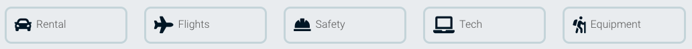

"Capturing the World: Exploring New Places and Moments Through the Lens"

Visit the deployed [Post Planner API ](https://travel-planner-api.herokuapp.com/)

Visit the [Post Planner repository ](https://github.com/Christoph33one/post-planner-api)

Visit the deplyed [Post, Plan & Travel Website ](https://post-plan-travel.herokuapp.com/)

Visit the [Post, Plan & Travel repository ](https://github.com/Christoph33one/post-plan-travel)

---

### Structure
<li><a href="#project-purpose">Project purpose</a></li>
<li><a href="#user-audience">User audience</a></li>
<li><a href="#user-stories">User stories</a></li>
<li><a href="#project-planning">Project planning</a></li>
<li><a href="#data-structure">Data structure</a></li>
<li><a href="#custom-components">Custom components</a></li>
<li><a href="#custom-hooks">Custom Hooks</a></li>

--- 
### UX & design
<li><a href="#design">Design</a></li>
<li><a href="#authentication">Authentication</a></li>
<li><a href="#profile-page">Profile page</a></li>
<li><a href="#landing-page">Landing page</a></li>
<li><a href="#create-post">Create a post</a></li>
<li><a href="#travel-posts">Travel post</a></li>
<li><a href="#popular-profiles">Popular profiles</a></li>
<li><a href="#search-bar">Search bar</a></li>
<li><a href="#following">Follow / unfollow</a></li>
<li><a href="#comments">Comments</a></li>
<li><a href="#wire-frames">Wire frames</a></li>
<li><a href="#colour-scheme">Colour scheme</a></li>

---

### Testing
<li><a href="#bugs">Bugs</a></li>
<li><a href="#manual-testing">Manual tests</a></li>
<li><a href="#frontend-testing">Front-end testing</a></li>

---

# Deployment setup
<li><a href="#deployment">Deployment</a></li>

--- 

# Technology
<li><a href="#technologys">Technology's</a></li>

--- 
# Credit
<li><a href="#credits">Credits</a></li>

---

# Project purpose

### Post, Plan & travel
Designed to help users plan trips abroad by providing them with a unique perspective on various destinations. By browsing through photos and travel experiences from other travelers, users can gain insights into popular and off-the-beaten-path locations. For adventure enthusiasts, Post Plan & travel offers inspiration to explore and experience new activities. With Post Plan & travel, planning a trip has never been easier or more exciting.

To fully immerse yourself in the website's offerings and access its complete range of features, signing up for a free account is required. Once registered, a world of possibilities opens up before you. You can delve into a wealth of captivating posts created by fellow users, engage in meaningful discussions by adding your own comments, and even showcase your personal travel experiences.

This platform is a haven for those with a keen eye for photography. It provides an ideal space to upload your mesmerizing images and narrate the stories behind them. By sharing your photos, you can capture the essence of your travel adventures and captivate the community with your visual storytelling.

Don't miss out on the chance to join this vibrant community of explorers, storytellers, and photography enthusiasts. Sign up today and unlock a world of travel inspiration, connection, and creativity.

---

# User audience
Post, Plan & Travel is designed to cater to people of all ages, genders, and backgrounds, embracing diversity and inclusivity. We firmly believe that everyone, regardless of their gender, should have equal opportunities to explore and enjoy the world. Whether you identify as male, female, non-binary, or any other gender, our platform welcomes and supports you in your travel endeavors.
For younger individuals, Post, Plan & Travel serves as an invaluable resource to plan their first solo trips or embark on adventurous holidays with friends. We understand the unique needs and interests of the younger generation and provide tailored content that appeals to their sense of exploration, adventure, and discovery.

However, our platform is not limited to any specific age group. We recognize that people in their middle ages may seek a well-deserved break from their busy lives and yearn to explore new destinations. Post, Plan & Travel offers a wealth of travel guides, itineraries, and suggestions that cater to the interests and preferences of individuals in different stages of life. Whether you're seeking relaxation, cultural immersion, or thrilling experiences, our platform has something to inspire and guide you.

One of the core principles of Post, Plan & Travel is accessibility. We believe that travel should be accessible to everyone, regardless of their budget. Our comprehensive travel guides and suggestions cover a wide range of budgets, ensuring that whether you're a budget-conscious backpacker or a luxury traveler, you'll find valuable information and recommendations that suit your needs.

In summary, Post, Plan & Travel is an all-encompassing platform that embraces diversity, caters to people of all ages and genders, and provides a wide range of travel resources and inspiration. We are committed to empowering individuals from all walks of life to explore the world, create unforgettable memories, and embrace the joy of travel.

---

# User stories

### Register

Sign up:

- As a user, I can easily locate the signup feature in the navigation menu.
- As a user, I am presented with a visually appealing and responsive signup form.
- As a user, I can securely enter my credentials, including password verification.
- Once logged in, I am seamlessly redirected to the sign-in page.

Sign in:
- As a user, I can conveniently sign in using my username and password.
- Password security measures are in place to ensure the confidentiality of my password.
- A clear and intuitive submit or cancel button is provided.
- If I choose to cancel my login, I am redirected back to the landing page.
- After successful login, I am immediately directed to the landing page where my profile avatar is prominently displayed.

Profile page:
- I can access my profile page and view my avatar, name, interests, and bio (if provided).
- A dropdown menu offers convenient options to change my username, password, and edit my profile.
- When editing my profile, a user-friendly form is presented with pre-populated information that I can easily modify. Additionally, updating my profile image is supported.

Verification:
- When changing my username, I am redirected to a separate form to enter my new username. If I attempt to select an existing username, a helpful message notifies me of the unavailability.
- While changing my password, I am required to enter a new password distinct from the previous one. Verification is prompted by re-entering the new password.
- Upon submitting my new username, I am seamlessly returned to my profile page.

Landing page:

- The landing page is thoughtfully designed with a clear and intuitive layout.
- The written content on the landing page is easily understandable, and all links are functional.
- A prominent navigation bar is available on the landing page to facilitate easy navigation to other sections of the website.

Locations page:
- Upon navigating to the locations page, a title is displayed, confirming the user's current location within the website.
- The latest post is prominently showcased at the top of the page, with the profile name of the post creator clearly mentioned.
- Users can effortlessly scroll through the landing page posts, which are loaded quickly for a seamless browsing experience.
- The responsive layout ensures that all images within the posts are displayed optimally across different screen sizes.
- Each post provides relevant information such as title, images, description, and captions for a comprehensive view.
- Users can easily identify the comment count on each post, along with an icon indicating user engagement. Clicking on the message and clickable icon allows users to view the post in more detail and access the comments section.

Posts page:
- Users can easily navigate from the list of all posts to a single post and access additional content.
- When viewing a single post, users are provided with more detailed information, including a convenient way to access the profile of the post creator.
- By scrolling down on the page, users can explore all the comments added to the post and witness the interactions between other users and the post.
- The page layout ensures that all content is displayed optimally on various screen sizes, with particular attention given to the positioning of images for a visually pleasing experience.

Comments:
- When viewing the list of comments, users can expect smooth scrolling with comments rendering quickly and efficiently.
- Each comment is presented clearly, featuring the written content and an optional image if provided by the commenter.
- Users can easily identify the profile associated with each comment, along with a timestamp indicating when the comment was made.
- If users wish to add their own comment, they will find an intuitive and user-friendly form where they can input their content and upload an image, if desired.
- Upon submitting a comment, users can immediately see their comment displayed at the top of the c omments list.
- For those who want to edit their comment, a modern and visually appealing dropdown button is readily available.
- When editing a comment, users have the ability to modify both the comment text and content, and upon resubmission, they can observe their edited comment being updated accordingly.

Popular profiles:

The list of popular profiles is readily accessible both on the list of posts and within individual post pages, making it convenient for users to explore.
Each profile in the list is presented with a prominent display of their profile name and avatar, ensuring easy recognition for users.
The arrangement of the popular profiles is strategically designed to convey the impression that the topmost profile is the most followed, highlighted by the presence of a follow/unfollow button beside each profile.
The follow/unfollow button dynamically adjusts its functionality, providing users with a clear indication of the action they can take (follow/unfollow) for each profile.
When users choose to follow or unfollow a profile, they can observe the impact on their own followers count, witnessing an increase or decrease accordingly.

---

# Project planning
For project requirements and project planning I followed the agile methodologies and best practices. I used a scrum board which is a built in feature in the projects repository with GitHub. 

Please click the [link](https://github.com/users/Christoph33one/projects/30/views/1) to view the project Kanban board

I created a list of project goals using agile user stories method. A user Story is a small, self-contained unit of development work designed to accomplish a specific goal within a product and articulate the value proposition for the work and drive the development work. 

With agile it is advised to use a team velocity approach. Team velocity represents how many story points the development team can manage to finish in one iteration of a particular length.

As I am the only one planning this project and not using a team, I will not be using the team velocity approach and point score system.

Using agile's MOSCOW method, each user story has been highlighted with the importance of the projects acceptance criteria. I used labels to indicate the importance of each user story and it's involvment with the project.

Please visit the [build log](https://github.com/Christoph33one/post-plan-travel/issues) 

---

# Data structure
Data Structure (models)
All of the data structuring was completed when creating my backend API. The repository and accompanying README can be found here: Click [here](https://github.com/Christoph33one/post-planner-api/blob/main/assets/data%20structure%20.png) to view.

---

# Custom components

### HeroImageComponent: 
The HeroImage component allows you to showcase visually appealing images or banners in the website. It helps in grabbing the user's attention and creating a memorable first impression.

### CategoryIcon: 
The CategoryIcon component allows you to display icons and links related to different categories on the website. It improves the user experience by providing intuitive visual cues and easy navigation.

### MoreDropdown: 
The MoreDropdown component provides a dropdown menu with additional options or actions. It helps in organizing and presenting additional features or settings, allowing users to access more functionality without cluttering the interface.

### NavBar:
For a reusable Navigation point I have implemented a Navbar component to be used on all pages thoughout the website. This helps in organizing and presenting additional features.

### Assest
The Asset component displays assets with a spinner, image, or message. It accepts props for each type and applies CSS styling for consistency.

### Avatar
The Avatar component renders an image with optional text overlay. It supports customizing the image source, height, and text content. The component applies CSS styling defined in the Avatar.module.css file.

### NotFound: 
The NotFound component is useful for displaying a custom error page when a user navigates to a non-existent or unavailable page. It improves user experience by providing a clear message and visual representation of the error, helping users understand and navigate back to valid content.

### Scroll to top
By incorporating the Scroll to Top component, users can effortlessly navigate to the beginning of a web page by simply clicking on the button that emerges as they scroll down. This convenient button grants users the ability to swiftly return to the topmost section of the page. I have made the decision to implement this feature on pages that holds the most content, including the travel post page and profile page. As the number of user-generated posts continues to grow, the Scroll to Top functionality will serve as a user-friendly enhancement, ensuring smooth and efficient navigation.

By incorporating these custom components, I can enhance the visual appeal, user experience, and functionality of the website, ultimately improving engagement and user satisfaction.

---

# Custom Hooks

### Redirect
Use redirect:
The useRedirect hook plays a crucial role in the site's security by preventing unauthorized users from accessing restricted areas of the website. It achieves this by performing a redirect based on the user's authentication status. When an unauthorized user attempts to access a protected endpoint directly through a URL, the hook intercepts the request and checks the user's authentication status. If the user is not logged in, the hook redirects them to the homepage, preventing unauthorized access to the restricted content.

By combining the useRedirect hook with manual endpoint handling and URL-based redirection, the site ensures that only authorized users can access restricted areas, enhancing security and improving the overall user experience.

### Toggle control

Click outside toggle: 
This hook is responsible for implementing a dropdown toggle effect in the website's navigation bar. It allows the dropdown menu to expand or collapse when clicking outside of the menu area.
This also enhances the user experience by providing an intuitive dropdown menu behavior.

---

# Design 

# Authentication

### Sign up
To fully utilize the features of this site, users are required to register. The Navbar provides easy access to the registration form, where users can create a username, set a password, and confirm it by re-entering the pasword for varifction.

Please note that all registration fields must be filled out before the registration process can be completed. The registration form incorporates built-in error handling to ensure that users cannot register without providing all the required information and a pasword with a minimum of 8 characters.

---

### Sign in
Upon signing in, users are presented with a user-friendly form that allows them to enter their credentials, including their username and a secure password. The password input field provides hidden feedback as the user types, ensuring a secure and seamless experience.

To enhance clarity, a prominent submit button is positioned below the input fields, clearly indicating where users should submit their sign-in information. By prioritizing user-friendliness and security in the sign-in form, we aim to establish trust and respect for our site's users.

In addition, I have incorporated an image to enhance the visual appeal of the form. The image is positioned to the right of the form in larger browser views, and for smaller screen sizes, it gracefully transitions below the form. This welcoming image aligns with the travel theme, aligning with the overall goals of the site.

To provide a convenient reminder for registered users and facilitate easier navigation for non-signed-in users, I have incorporated a message and a link below the form. This serves as a helpful prompt, directing users to the sign-in page and enabling them to access their accounts effortlessly.

### Change user name & password
The purpose of this function is to enable users to change their passwords and usernames without the need to request assistance from a site administrator. By offering this functionality directly to the users, we aim to enhance the sign-in experience by providing a more efficient and streamlined process for resolving password-related issues.

Empowering users with the ability to change their passwords not only simplifies the response to sign-in problems but also instills a greater sense of security. By allowing users to take control of their own accounts and update their valuable information, we prioritize their privacy and provide them with a more secure environment.

### Sign out
To ensure a streamlined user experience, all signed-out users are automatically redirected to the home page upon accessing any other page of the website. In order to maintain data integrity and avoid potential errors, if a user manually attempts to access the URL endpoint "/signout/", they will be redirected to a custom-designed "No Data Found" page. This page serves as a placeholder, indicating that the requested page does not exist and does not have any specific functionality. This approach not only prevents unauthorized access but also provides a clear and consistent browsing experience for users, eliminating any confusion or disruptions caused by invalid URLs.

---

# Profile page
When exploring the profile page, I aimed to create a delightful and engaging experience for users. The profile serves as a hub for users to curate their favorite activities from a diverse selection of popular travel options. To add a touch of personalization and align with contemporary design trends, I included the option for users to upload a vibrant avatar, giving their profile a unique flair that reflects their personality.

Additionally, I incorporated a bio section where users can freely express themselves and share compelling information about their interests and experiences. Recognizing the importance of individual identity, a preset title or name is provided to ensure a meaningful profile representation.

On the profile page, users can conveniently access and manage all their posts on the site. By providing a comprehensive view of their latest posts and all other contributions, users can stay updated with their own content as well as the wider community. To enhance the user experience, we have made a subtle improvement by displaying the post count just below the user's name. This feature allows users to effortlessly track the number of posts they have created, offering a simple and intuitive way to gauge their contribution.

By blending simplicity, creativity, and user-centric design, the profile page becomes a captivating canvas where users can showcase their favorite activities and tell their travel story with enthusiasm.

### Profile edit form
This form is designed to prioritize the security of the profile and is only visible to the owner. At the top of the profile page, there is a dropdown menu represented by a three-dot icon, adhering to modern design principles and functionality. When the user clicks on the dropdown menu, three options are presented: username change, password change, and edit profile.

For the username and password change options, the user is redirected to separate forms where they can update their username and password securely.

The edit profile function provides the user with a pre-populated form that allows them to update their avatar, title, bio, and activities. Once the user has made the desired changes and submits the form, they are redirected to their newly updated profile.

By implementing these measures, we ensure that the owner has full control over their profile while maintaining a user-friendly and secure experience.

The profile page is designed to have a responsive layout, adapting seamlessly to various browser screen sizes, including a minimum width of 360px. This ensures that users can access and navigate the profile page comfortably regardless of the device or screen size they are using. By optimizing the layout for responsiveness, we prioritize a consistent and user-friendly experience across different platforms and screen resolutions.

To maintain content safety and uphold security standards, it is important to restrict users from editing or deleting profiles that they do not own. This measure ensures that followers and the wider community can trust the authenticity and integrity of the content shared on the platform. By implementing strict criteria and access controls, the site mitigates security risks associated with unauthorized user modifications. Users can rest assured that their profiles are safeguarded and that only the original owners have the ability to edit or delete their own content. This policy contributes to a secure and reliable environment for all users, promoting trust and maintaining the integrity of the platform.

---
### Navigation 
To provide users with a seamless and modern browsing experience, I have incorporated a simple yet effective navigation menu at the top of the website, which is displayed consistently across all pages. This feature allows users to easily access essential pages such as the Home page, Locations page, Sign Up, Sign In, and Sign Out, without having to search for them.

Moreover, to enhance the user's sense of personalization, I have implemented a unique feature in the Navigation bar. When users are signed in, they can view their login name prominently displayed on the Navigation bar, providing a sense of ownership and recognition to the user. This small yet significant touch adds a personal touch and makes the user feel valued, thereby improving their overall browsing experience.

Icon provider - [logo generator](https://favicon.io/logo-generator/)

---

# Landing page
Drawing inspiration from the homepage of [trip Advisor](https://www.tripadvisor.com/), I have incorporated essential features to enhance the user experience and facilitate access to relevant external links related to travel. Additionally, I have included a donations link to remind users about the importance of responsible travel and encourage them to contribute to the provided cause.

To create a captivating visual impact, I have strategically incorporated a hero image in two key areas of the site, evoking a sense of wanderlust and adventure for the users.

For visually pleasing design, I have utilized various shades of blue throughout the site. This color scheme ensures a soothing and harmonious aesthetic that complements the images without creating any clashing color combinations.

To cater to mobile screen sizes, including a minimum width of 360px, the landing page has been meticulously designed to respond to different breakpoints. This approach ensures that the layout remains user-friendly and adapts seamlessly to varying screen sizes, providing an optimal viewing experience for mobile users.

---

# Create post
Users can navigate to the "Add a Post" page to create their own unique posts. This project focuses on showcasing travel experiences through images, allowing users to upload and post up to six images with optimal sizing on all screen sizes. Only authenticated users have the privilege to add a post, which will be visible to other users on the locations page.

The "Add a Post" page provides a user-friendly interface with pre-populated form fields and clear instructions. Users can add a title, description, location, and caption to their posts, ideally sharing their thoughts and experiences related to the images.

Currently, all six images must be added in one instance, but future updates will allow users to upload a minimum of one image. All form fields are required to be filled in a post, as this helps the website gather user feedback and provides more information to other users about the travel post. Error handling has been implemented into the image uplpoading and form to retun reback for the user to complete the requirements before submitting a post.

To enhance user experience, the submit and cancel buttons are equipped with a redirect function that takes users back to the home page when clicked. This ensures a smooth transition between adding a post and returning to the main page.

---

# Travel posts
This page serves as the centerpiece of the website, offering all users an opportunity to explore travel plans and experiences shared by fellow travelers. My aim was to create a modern and sleek design for displaying both images and content. Users can discover more than just the posts themselves; they can also access profiles of the individuals who created the posts, along with the date of their addition.

Users can further engage with posts by clicking on the icons below the post content, granting them access to a dedicated page where they can view the post in detail and explore the associated comment list.

This page is designed to be fully responsive, ensuring optimal viewing across all screen sizes by adhering to responsive guidelines and breakpoints.

---

### Travel posts edit form
To enhance the user-friendliness of the site, I have implemented a convenient post editing feature. Users can easily access this functionality from the main post menu. By clicking on the dropdown button, they have the option to edit or delete a post. To delete a post, users can simply click on the delete post icon. Once deleted, users are seamlessly redirected to the posts page, where the deleted post is no longer visible.

For editing a post, users are redirected to the familiar "Create a Post" form, which automatically populates with the original images and pre-filled content. This enables users to review and adjust their post easily. This functionality proves invaluable for users who may have posted the wrong image or made a spelling mistake, providing a convenient way to make corrections.

By incorporating this user-friendly post editing feature, the site empowers users to have greater control over their content, ensuring a more seamless and enjoyable user experience.

To maintain content safety and uphold security standards, it is important to restrict users from editing or deleting posts that they do not own. This measure ensures that followers and the wider community can trust the authenticity and integrity of the content shared on the platform. By implementing strict criteria and access controls, the site mitigates security risks associated with unauthorized post modifications. Users can rest assured that their posts are safeguarded and that only the original owners have the ability to edit or delete their own content. This policy contributes to a secure and reliable environment for all users, promoting trust and maintaining the integrity of the platform.

 

--- 

# Popular profiles
One notable feature on this page is the "Popular Profiles" section. This feature aims to foster a sense of community among globe-trotters by highlighting popular profiles based on their follower count. Users can easily stay connected with their favorite influencers and fellow travel enthusiasts. The "Popular Profiles" list showcases the most followed profiles and provides a follower count. Additionally, a convenient follow button is included, allowing users to effortlessly follow or unfollow a profile with a single click. 

---

# Search bar
This feature greatly simplifies the location search process for users, especially considering the vast number of posts being added. To address this challenge, a convenient filtering method has been implemented. When a user starts entering characters into the search bar, the website dynamically filters and retrieves matching locations from the database.

To provide a smoother user experience, a one-second delay has been added before displaying the search results. This delay allows users to input more characters before the search is executed, improving the filtering accuracy and responsiveness. Additionally, a loading spinner may appear if the search results take longer to retrieve, notifying the user that the data is being filtered and loaded.

By incorporating these enhancements, the feature enhances the overall user experience by simplifying the location search process, providing real-time filtering, and offering visual cues for search progress.

A no results image will be displayed if no locations are found

---

# Following
To foster a vibrant community of globe trotters, I have implemented a modern feature inspired by popular platforms like [Instagram ](https://www.instagram.com/). Users now have the ability to follow profiles, enhancing connectivity and engagement. By simply clicking the "Follow" button, users can effortlessly increase their following count, which is prominently displayed on their profile page. This allows users to stay informed about the number of profiles they follow. Similarly, when a user is being followed by others, their profile will reflect the number of followers they have gained.

There are two convenient methods for users to follow or unfollow profiles. They can either explore the "Popular Profiles" list or directly visit the profile they are interested in. This seamless experience provides users with the flexibility to engage with profiles they find intriguing, fostering connections within the community.

---

# Comments
To enhance the sharing capabilities within the community, I have introduced a feature that enables users to add both comments and images to the discussion. As the website revolves around image sharing, it is important to extend this functionality to the comments section. Imagine a scenario where a user has posted about a particular location, and another user wants to showcase a different location to enrich the conversation. Now, with the ability to upload images along with comments, users can effectively communicate and make the site even more engaging and valuable. This feature adds a new dimension to user interactions, promoting a fun and interactive environment.

---

### Comments edit form
To empower users with control over their comments, I have implemented an editing feature. Users have the ability to modify the text or image content of their comments by accessing a convenient dropdown menu associated with their own comments. Upon submitting the edited comment, users are seamlessly redirected back to the main comments section where they can instantly view the updated version of their comment. This functionality ensures a streamlined editing process, allowing users to refine and improve their contributions effortlessly.

To provide users with up-to-date information across the site, all comments now display the date they were added and the most recent to the very top of the comments list. This feature ensures users have a clear understanding of the timeline and helps them stay informed about the recency of comments throughout the platform. By including the added date alongside each comment, users can easily gauge the latest discussions and engage with the most relevant content. This feature enhances the overall user experience by promoting transparency and timeliness across all areas of the site.

--- 

# Wire frames

### Home page

### Registration & Sign in

### Create a travel plan page

### Posted travel plan page

### Edit travel plan page

---

# Typography
All font family styling was used with an open source - [google fonts](https://fonts.google.com/?preview.text=POST,%20PLAN%20%26%20TRAVEL&preview.text_type=custom)

Font family used for H1 - Oswald "regular 400" 

Default setting - "sans serif"

Font family used for H3, H4 & P - Roboto"light 300"

Defaul setting - "sans serif"

All icons are taken from an open source - [Font awesome ](https://fontawesome.com/)

---

# Colour scheme 

All colours where picked with design industry colours which are trusted within communities of website design. I used an Wilderness colour plate in Adobe Color Wheel. using shades of blue  are used. For when using the shade of black I used #0D0D0D. This shade gives a deeper colour and more detail to text.

The reason I have not used many colours, is for the images to produce the colour to the site. As the images are full of colour, I wanted them to stand out and make an impression to the user.

All colours are taken from an open source - [Adobe Color Wheel ](https://color.adobe.com/trends/Wilderness?page=4)

---

# Bugs
### Navbar
ERROR
In the NavBar component, when passing the expanded prop to the Navbar component, you are assigning the setExpanded function instead of the expanded state value. The correct code should be:

PASS ERROR
Passed expanded prop to the navabr component

### Post Page 
Issue:
Data base not being updated. Error 400 in the console.

SOLUTION:
After reviewing the Network in the console, I could read that the Error was that I did not add the locations field from the api model as an object and call it the in useState Hook. Once adding this, all data was being saved in the database.

ISSUE:
When implementing the search feature to allow users to search for travel plans by location, I encountered an error in the PostsPage function. Despite using the filter method and a try-catch block with axiosReq (request) to fetch data from the travelplanposts/ URL, the posts data was not being displayed on the /locations page.

SOLUTION:
Upon reviewing the API for fetching the posts data, I discovered a typing error in the URL within the catch block. This mistake prevented the data from being fetched, causing the spinner component to continue running without rendering any results. After correcting the typing error, the posts data was successfully rendered on the page.

### PostCreateFrom
Issue: 
When a user creates a post and attempts to add less than six images, a default image should be displayed instead of the missing images. This functionality is controlled through the API using a default image URL. However, there was an issue where the default image failed to render, resulting in an upload error being displayed in the console.

Solution:
To address this issue, I used the built-in Alert error handling feature provided by React. By importing this function, I was able to integrate it into each image element within the form during the rendering process. Additionally, I included a custom message stating "Please add six images" to inform the user about the minimum image requirement.

By implementing these changes, I successfully resolved the problem by effectively handling errors and providing clear instructions to the user. This resulted in the elimination of all errors encountered during the process.

### MoreDropDown component
ISSUE:
While implementing the handleDelete prop into the onClick function within the return statement of the MoreDropdown component, I encountered difficulty in getting the delete function to successfully delete a post associated with the current user.

SOLUTION:
Upon careful examination, I identified a typing error within the handleDelete prop when it was used inside the onClick function. After correcting the value, I performed a test and confirmed that the delete function is now functioning properly.

### PostEditFrom page
ISSUE: While implementing the edit function for users to update their travel plans, I encountered a problem where a single image would not update correctly. Instead, I was redirected to the page with the original image.

SOLUTION:
Upon testing, I found that I could only update all the images at once and not a single image. This issue was down to having the if statement that checks the condition was wraped around all the image files to be appended. To address this, I restructured the if statement to apply to each image individually. After conducting further tests, I am now able to successfully update a single image.

### Travel post page
ISSUE: When implementing comments, I used the map method to iterate over the comments results. However, when running the project in the browser, a blank page was displayed.

SOLUTION: Upon reviewing the error in the console, I realized that I was mistakenly mapping over the incorrect value of results. After correcting the value, the page rendered correctly.

### ProfilePage
Issue:

While attempting to render all posts by a user from their profile page, I encountered a problem where the page would appear blank and an error would be logged in the console for fetchMoreData.

Solution:
Upon reviewing the console error, I identified a type error in the hasMore={!!profilePosts.next} code. It was discovered that I had removed the second exclamation mark (!), which resulted in the incorrect rendering of images within fetchMoreData. By rectifying this issue, the images were displayed correctly.

Issue:
When a user is not logged in, they can manually added the url endpoint /profiles/3, then the user can access the profile of the user using the profile id

Solution:
After reviewing the useRedirect Hook and implementing it into the ProfilePage function, the loggout user could not acceess any of the profiles.

### ProfileEditForm
Issue:
When a user is not logged in, they can manually added the url endpoint /profiles{id}/edit, then the user can access the profile edit page of another user.

Solution:
After reviewing the useRedirect Hook and implementing it into the ProfileEditForm function, the loggout user could not acceess to edit a profile they do not own.

### PostCreateFrom
Issue:

When a logged out user attempts to access the "create a post" form, they can manually add the URL endpoint "/posts/create." This leads them to the form, even though it should only be accessible to authenticated users. This poses a security risk and needs to be addressed.

Solution:

Upon reviewing the userRedirect Hook, I observed that the 'logged in' and 'logged out' values inside the Hook are enclosed in single closing tags. However, in the PostCreateForm function, the useRedirect prop's value were written as a string using double brackets "".
This inconsistency led to a malfunction in the redirect hook. However, after review the code by ensuring consistent double closing tags in the useRedirect hook, the test passed successfully. Consequently, the create post page is now inaccessible to logged out users, effectively bolstering the overall security measures.

### PostsPage 

Issue:
When a usewr is not logged in, manually added the url endpoint /locations/ the user can access the locations page and view all posts.

Solution:
After reviewing the useRedirect Hook and implementing it into the PostsPage function, the loggout user could not acceess the posts page and view no posts.

### SignIn
Issue:

When a logged in user attempts to access the sign in form, they can manually add the URL endpoint "/signin." This leads them to the form, even tho it should not be accessible and the user should be redirected back to the home page "/"

Solution:

Upon reviewing the userRedirect Hook, I observed that the 'logged in' and 'logged out' values inside the Hook are enclosed in single closing tags. However, in the SignInForm function, the useRedirect prop's value were written as a string using double brackets - useRedirect("loggedIn")
This inconsistency led to a malfunction in the redirect hook. However, after review the code by ensuring consistent double closing tags in the useRedirect hook, the test passed successfully and the iser is redirected to the home page.

### Signup
Issue:

When a logged in user attempts to access the sign up form, they can manually add the URL endpoint "/signup." This leads them to the form, even tho it should not be accessible and the user should be redirected back to the home page "/"

Solution:

Upon reviewing the userRedirect Hook, I observed that the 'logged in' and 'logged out' values inside the Hook are enclosed in single closing tags. However, in the SignInForm function, the useRedirect prop's value were written as a string using double brackets - useRedirect("loggedIn")
This inconsistency led to a malfunction in the redirect hook. However, after review the code by ensuring consistent double closing tags in the useRedirect hook, the test passed successfully and the iser is redirected to the home page.

---

# Manual testing

### Authentication:

SIGN UP
-  As a user I can view a registration point and view a form to add my credentials.
- The form is well displayed and gives simple instructions on where to add my credentials.
- The form gives good user security practice known as "password confirmation" or "password verification.
- If I select a password with less then 8 characters, I am displayed a notification to add a lager password.
- Once signed up, I am redirected to the sign in form.
- I can view the form is nicely responsive in all screen sizes. 
---

SIGN IN
- As a user I can view a navigation point to sign in. 
- I can view a well displayed form to add my sing in credentials. 
- As a user I can view password security as my password is not displayed back to me when adding.
- When signing in, I am redirected to the home page as intended.
- When using the wrong credentials, I am not able to log in and returned a message to notify me.
- I can view the form is nicely responsive in all screen sizes 
---

SIGN OUT
- As a user can view the sign out navigation point 
- When signing out I am redirected to the home page as expected 
- When signed out I can sign back in when intended
---

PROFILE PAGE
- As a user I can view a Navigation point to my profile page when logged in.
- When viewing my profile and page I can see all the posts I have created starting with the most recent one first.
- I can view how many posts I have created with a posts count.
- I can view how many users are following my profile and how many I follow in return.
- I can view my name, avatar, bio and an activity that I enjoy doing.
- As a profile owner I can view a drop down menu to edit my profile.
- Upon viewing the edit profile function, with a per-populated form, I can edit my details and avatar image.
- After submitting the edited profile I am returned back to my profile page with the changes made.

----

### HOME PAGE:
- As a user I can view the home page and its responsiveness on all screen sizes.
-  As a user viewing the home page I can click on all links and be redirected to a new tab and view the information relating to the link
- As a user I can read and understand all the content written and view the images easily 
- As a user I can view a navigation point to navigate me to tother resources in the website 
-  As a user I can view all the content on all screen sizes and to its responsive functions 

---
### Create a travel post
- As a user I can easily view a Navigation point to the page for adding a travel post.
- I can see an early to follow form with well written text to follow when writing a post.
- I can write a title, description, location and a caption.
- When doing more than the required amount of letters, I will be returned a message to notify me to make corrections with my text length.
- I can upload is images by clicking on the upload icon which returns me my files.
- I can view a submit button and a cancel button.
- Once my post is submitted, I am redirected to the posts page to view my post.
- If I decide to cancel my post, and click the cable button, I am returned to the landing page.
---

### Travel plan page
TRAVEL PLAN PAGE
- As a registered user I can navigate to the travel plan page to view all the post
- When viewing the posts, I can see the newest created first
- As a user I can clearly see the profile who created the post, the images are nice and clear and well organised on all screen sizes
- As a user I can see a title, created at date, the users content about the post and images.
- A caption is present to keep the post fun!
- Icons are placed in the correct areas to view a better IX feel
- A link to view the post as a single post, which redirects the user to a new page for just that post.
- When logged out I can not view any posts.

### Travel plan edit

---
### Popular profiles
- As a user I can also see a clear and well designed most followed profiles list with the user name and avatar.
- I can easily view and click on a user to view their profile.
- On a smaller screen size the list is nicely positioned above the post images and search bar, also reduced to give better readability and UX.
- when logged out, I can noit view the list of popular profiles

---

### Comments
- As a user I can view a comment count at the bottom of each comment.
- As a user I can click on the view a single post and view all the comments and images related to the post.
- As a user I can see the user who created the comment with their name and avatar visible, plus a created at date.
- As a user I clearly add my very own comment and image with a easy to follow form that is validted on request.
- As a user I can view the comment and image I had added.
- If I want to edit my very own comment, I can view a Navigation point for editing the comment text and image. 
- Once my edited comment is submitted, I can view it in the list of comments.
- When logged out, I cannot  add, view, edit or delete a comment.
- When viewing other users comments, I can not edit or delete a comment not owned be myself 

---

### FOLLOW / FOLLOWING
- As a user I can view a list of profile from the popular profiles list and view a follow button
- When selecting to follow a profile, I can view the button text change from follow to unfollow.
- When selecting to follow a user, I can view the following count on my profile increase when folling a profile or decrease if I choose to unfollow a user
- When being followed by other profiles, I can view the number of followers in my profile.
- If logged out, I can not view follow or unfollow a user. 

---

### CHANGE USER NAME / PASSWORD
- As a user I can select to change me user name and view a pre-populated form with the current username
- When adding a user that already exist, I am returned a notification message to use a different username
- When using a new user name, I can Log in with that user name and the user old username dose not work
- When changing my password, I can view a form with two inputs fields. The form gives good user security practice known as "password confirmation" or "password verification.
- Once submitted I can login in with the new password.
- I can not log in with the old password.

--- 

# Frontend testing

### CSS validation tests
No errors or warnings were found when the deployed Happening URL was passed through the W3C CSS Validation checker.

---

### HTML Validation tests

The deployed URL was successfully validated using the W3C CSS validation checker without any errors. However, during the validation process, some informational messages were generated regarding the standard Meta code present in the index.html file.

 ### JSLint tests
I used JSLint and Prettier to ensure the quality and consistency of my JSX code. JSLint helped me detect potential errors and enforce coding best practices, ensuring that my code follows strict standards. Prettier, on the other hand, helped me maintain a consistent code style by automatically formatting my code according to predefined rules. Together, these tools helped me improve the readability, maintainability, and overall quality of my JavaScript code.

During my final testing, I encountered 17 warnings indicating that React was imported but never used. These warnings specifically related to the imports of React in the useEffect and useRedirect hooks. As a newcomer to React and still exploring its full capabilities, I decided to keep these warnings intact to ensure I don't overlook any potential project functionalities. By doing so, I aim to protect myself from potential project failures and continue learning and leveraging React's full potential in future endeavors.

During the JSLint test report, I came across 13 errors related to unused values in the tests. I want to clarify that as a newcomer to React, I am still in the process of familiarizing myself with testing procedures. I reached out to the tutoring team at Code Institute on multiple occasions for guidance on my tests. Their feedback emphasized that testing is an advanced topic beyond the scope of the course, but they encouraged me to do my best in running tests and documenting the process.

---

### Automated tests

I conducted four automated testing on the NavBar component by implementing test protocols that initially caused the tests to fail and then ensuring that they passed successfully. However, I must admit that testing is an area where I feel less confident, and given more time, I would have liked to delve deeper into it to gain a better understanding. Unfortunately, due to time constraints, I had to prioritize other tasks.

Sign in

Sign in / sign up return render log out

Home page renders

Profile render if logged in

---

# Deployment 

### Forking the GitHub Repository

- Go to the project [repository ](https://github.com/Christoph33one/post-plan-travel)
- In the right most top menu, click the "Fork" button.
- There will now be a copy of the repository in your own GitHub account.

### Running the project locally
- Go to the project [repository ](https://github.com/Christoph33one/post-plan-travel)
- Click on the "Code" button.
- Choose one of the three options (HTTPS, SSH or GitHub CLI) and then click copy.
- Open the terminal in you IDE program.
- Type git clone and paste the URL that was copied in step 3.
- Press Enter and the local clone will be created.

### Alternatively by using Gitpod:
- Go to the project [repository ](https://github.com/Christoph33one/post-plan-travel)
- Click the green button that says "Gitpod" and the project will now open up in Gitpod.

### Deploying with [heroku ](https://dashboard.heroku.com/)
- Go to Heroku.com and log in; if you do not already have an account then you will need to create one.
- Click the New dropdown and select Create New App.
- Enter a name for your new project, all Heroku apps need to have a unique name, you will be prompted if you need to change it.
- Select the region you are working in.

### Heroku Deployment
- In the Deploy tab:

1. Connect your Heroku account to your Github Repository following these steps:
    - Click on the Deploy tab and choose Github-Connect to Github.
    - Enter the GitHub repository name and click on Search.
    -  Choose the correct repository for your application and click on Connect.

2. You can then choose to deploy the project manually or automatically, automatic deployment will generate a new application every time you push a change to Github, whereas manual deployment requires you to push the Deploy Branch button whenever you want a change made.

3. Once you have chosen your deployment method and have clicked Deploy Branch your application will be built and you should now see the View button, click this to open your application.

---

# Technology's

[React ](https://react.dev/) - Development framework

[JSX](https://legacy.reactjs.org/docs/introducing-jsx.html) - Component Markup Language

[CSS](https://www.w3schools.com/css/css_website_layout.asp) - Cascading Style Sheets / StyleScript / 
dynamically manipulate and control the presentation of content.

[HTML](https://www.w3schools.com/howto/howto_make_a_website.asp) - Hypertext Markup Language / Content Markup Language

[Trip Adivsor ](https://www.tripadvisor.com/) - Where all trips are planned and made, for design inspiration.

[Logo generator ](https://favicon.io/logo-generator/) - Creating simple logos for free

[Font awesome  ](https://fontawesome.com/) - Font awesome - Icon generator

[Uizard.io ](https://app.uizard.io/) - Wire frame creator

[Drawsql.app ](https://drawsql.app/)  - Design data model structure

[ Pixels ](https://www.pexels.com/) - Supplying free downloadable images

[ Google fonts](https://fonts.google.com/?preview.text=POST,%20PLAN%20%26%20TRAVEL&preview.text_type=custom) - Pre generated fonts for all text.

[React Bootstrap Docs ](https://react-bootstrap-v4.netlify.app/) - The official docs for React Bootstrap components.

[Stack Overflow](https://stackoverflow.com/) - Supported me in understanding: try/catch blocks, Routes in React, and adding custom fields to models in Django Rest.

[ djangoproject.com](https://www.djangoproject.com/start/overview/) - Officially React documentation and functions

[ cloudinary.com](https://console.cloudinary.com/console/c-bc29bdd73130ab10f676494e4e2a13/getting-started-dam) - Image file source and image storage tool

[ ESLint](https://eslint.org/docs/latest/) - JavaScript code analysis tool for catching errors and enforcing coding style

---

# Credits

I would like to express my gratitude to the following individuals who have played a significant role in my personal project's success:

The Code Institute walkthrough project 'Moments' for providing me with valuable structure and direction throughout my journey.
A special thank you to my mentor, Lauren Nicole, for her unwavering support, quick responses to my queries, and invaluable guidance during our project milestone meetings.
I am also grateful to the Code Institute tutors who have helped me navigate through challenging debugging tasks, as those experiences have been instrumental in enhancing my learning.

I also want to thank [Kelz ](https://github.com/quiltingcode),  [Chris.F ](https://github.com/Chrisfaherty) & [Nick Coles ]( https://github.com/NickdevC/)
 (fellow Code Institute students). By joining together and engaging in remote study sessions your conversation and input kept me on track and motivated to push myself with regards to the project. Constructive venting and questioning, both contributed to much needed progress!

 The slack community for going through any Q&A.

